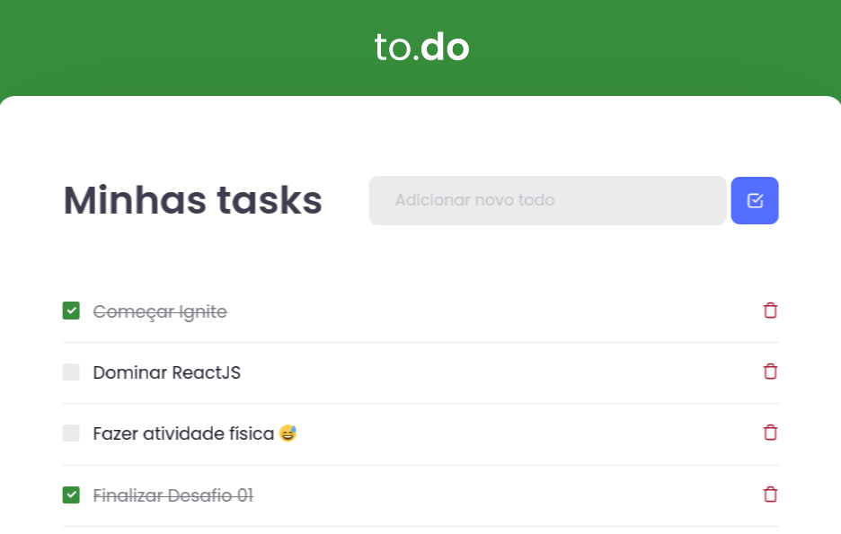

# to.do

Aplicação desenvolvida durante o primeiro desafio da trilha de ReactJS do Ignite.

## Aplicação

Aplicação consiste na criação de um app de listas de tarefas que possui as seguintes funcionalidades:

* Criar novas tarefas
* Marcar uma tarefa como concluída
* Apagar uma tarefa

## Conteitos abordados

Para a resolução dessa atividade foram utilizados os seguintes conceitos:

* Propriedades (props)
* Estado (state)
* Hooks